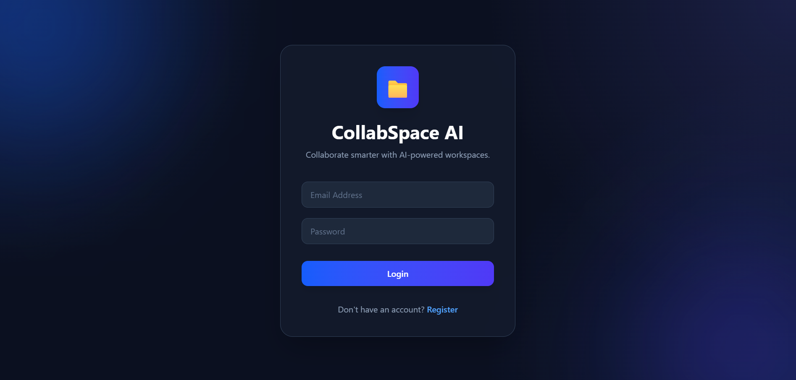
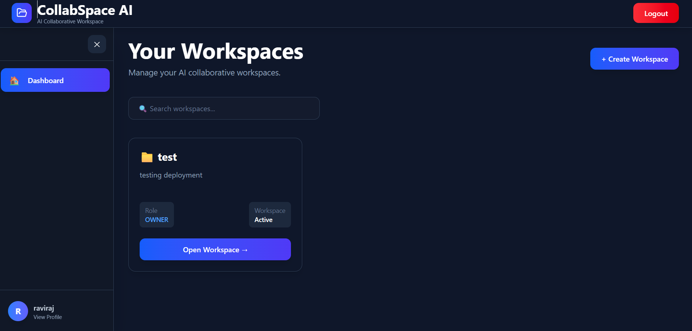
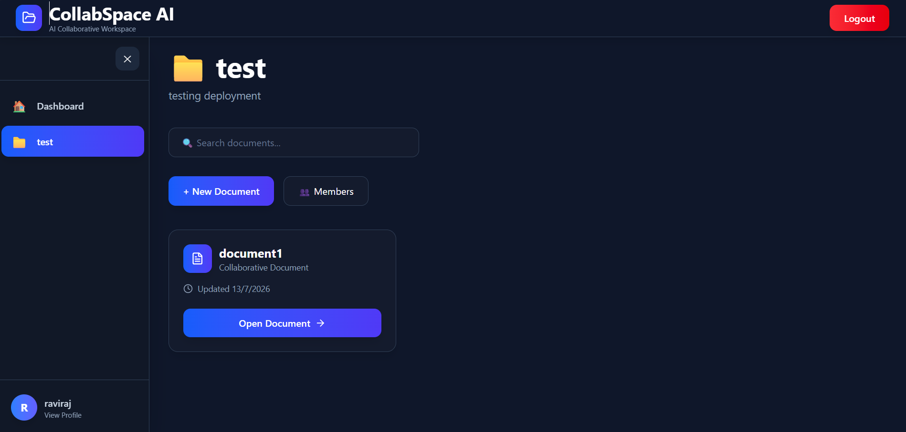
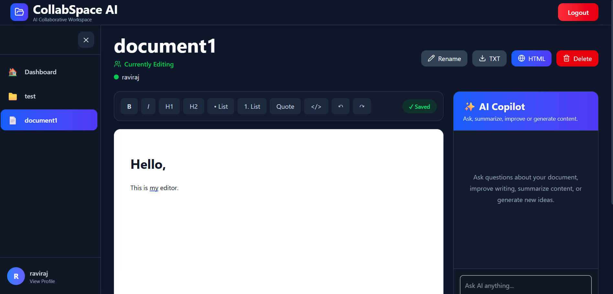
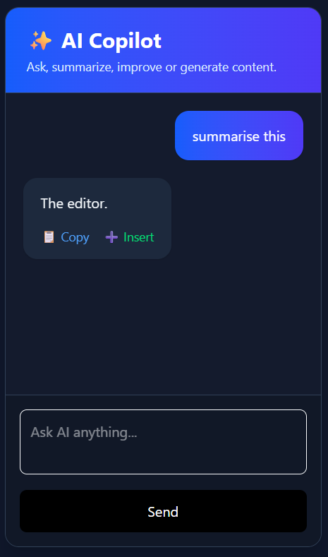
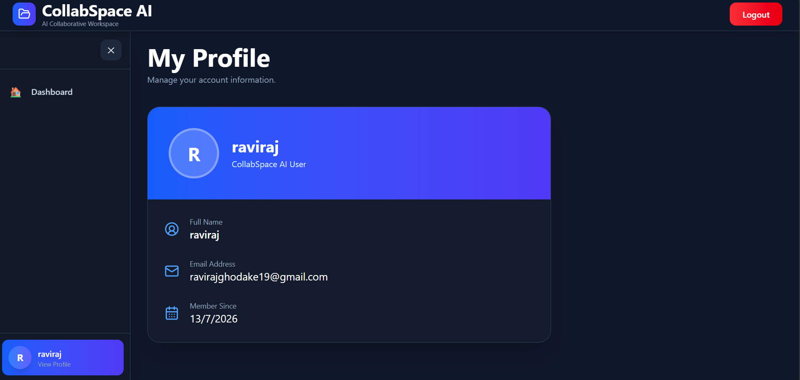

# 🚀 CollabSpace AI

> An AI-powered collaborative document platform that enables teams to create workspaces, edit documents in real time, collaborate seamlessly, and boost productivity with an integrated AI Copilot.

---

## 🌐 Live Demo

### Frontend
https://collabspace-ai.vercel.app

### Backend API
https://collabspace-ai.onrender.com

---

# ✨ Features

### 🔐 Authentication
- User Registration
- User Login
- JWT Authentication
- Protected Routes

---

### 📁 Workspace Management

- Create Workspace
- View Workspaces
- Search Workspaces
- Invite Members
- Change Member Roles
- Remove Members
- Leave Workspace

---

### 📄 Document Management

- Create Documents
- Search Documents
- Rename Documents
- Delete Documents
- Download as TXT
- Download as HTML

---

### 🤝 Real-Time Collaboration

- Multiple users editing simultaneously
- Live online collaborators
- Instant document synchronization
- Socket.IO powered communication

---

### 🤖 AI Copilot (Google Gemini)

- Ask questions about documents
- Summarize content
- Improve writing
- Generate ideas
- Insert AI response directly into the editor
- Copy AI responses

---

### ✍️ Rich Text Editor

Powered by **TipTap**

Supports:

- Bold
- Italic
- Underline
- Headings
- Lists
- Quotes
- Code Blocks
- Undo / Redo
- Auto Save

---

### 👤 User Profile

- View profile
- Account information
- Member since

---

# 🛠 Tech Stack

## Frontend

- React.js
- Vite
- Tailwind CSS
- React Router
- Axios
- React Query
- TipTap Editor
- Socket.IO Client
- React Hot Toast
- Lucide Icons

---

## Backend

- Node.js
- Express.js
- Prisma ORM
- PostgreSQL
- Socket.IO
- JWT Authentication
- bcrypt
- Google Gemini AI
- Zod Validation

---

## Database

- PostgreSQL
- Neon Database

---

## Deployment

Frontend

- Vercel

Backend

- Render

Database

- Neon

---

# 📂 Project Structure

```
CollabSpace-AI
│
├── backend
│   ├── prisma
│   ├── src
│   │   ├── controllers
│   │   ├── middlewares
│   │   ├── repositories
│   │   ├── routes
│   │   ├── services
│   │   ├── socket
│   │   ├── utils
│   │   ├── app.js
│   │   └── server.js
│   └── package.json
│
├── frontend
│   ├── src
│   │   ├── ai
│   │   ├── common
│   │   ├── context
│   │   ├── editor
│   │   ├── hooks
│   │   ├── layout
│   │   ├── pages
│   │   ├── services
│   │   ├── socket
│   │   └── utils
│   └── package.json
│
└── README.md
```

---

# 🏗 Architecture

```
React + Vite
      │
      │
Axios + Socket.IO
      │
      ▼
Express.js API
      │
      │
 Prisma ORM
      │
      ▼
 PostgreSQL (Neon)
      │
      ▼
Google Gemini AI
```

---

# ⚙️ Installation

## Clone Repository

```bash
git clone https://github.com/Ravirajghodake07/collabspace-ai.git

cd collabspace-ai
```

---

## Backend Setup

```bash
cd backend

npm install
```

Create

```
backend/.env
```

```
DATABASE_URL=

JWT_SECRET=

JWT_EXPIRES_IN=7d

GEMINI_API_KEY=

PORT=5000
```

Run

```bash
npm run dev
```

---

## Frontend Setup

```bash
cd frontend

npm install
```

Create

```
frontend/.env
```

```
VITE_API_URL=http://localhost:5000/api
```

Run

```bash
npm run dev
```

---

# 📡 API Endpoints

## Authentication

```
POST /api/auth/register

POST /api/auth/login
```

---

## Workspaces

```
GET    /api/workspaces

POST   /api/workspaces

GET    /api/workspaces/:id

POST   /api/workspaces/:id/invite
```

---

## Documents

```
GET    /api/documents/:id

PUT    /api/documents/:id

DELETE /api/documents/:id
```

---

## AI

```
POST /api/ai
```

---

# 📸 Screenshots


## Login



## Dashboard



## Workspace



## Document Editor



## AI Copilot



## Profile



---

# 🚀 Deployment

Frontend

- Vercel

Backend

- Render

Database

- Neon PostgreSQL

---

# 🔒 Environment Variables

Backend

```
DATABASE_URL

JWT_SECRET

JWT_EXPIRES_IN

GEMINI_API_KEY

PORT
```

Frontend

```
VITE_API_URL
```

---

# 📈 Future Improvements

- Google Authentication
- Email Verification
- Password Reset
- Comments
- Notifications
- Version History
- PDF Export
- Presence Cursor
- Dark Mode
- Docker Support

---

# 👨‍💻 Author

**Raviraj Ghodake**

GitHub

https://github.com/Ravirajghodake07

---

# ⭐ Support

If you found this project helpful,

please consider giving it a ⭐ on GitHub.

---

# 📜 License

This project is licensed under the MIT License.